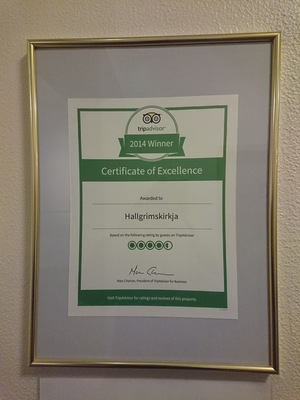
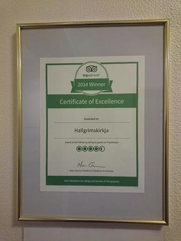
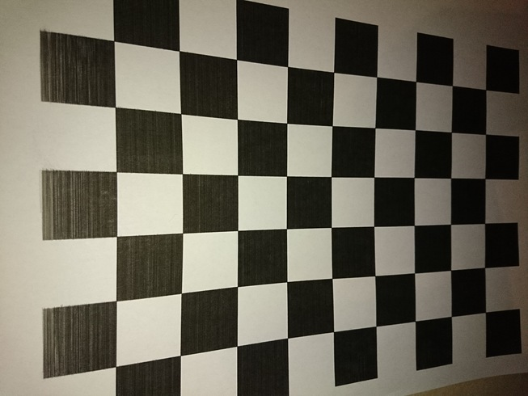

unfish -- correct fisheye distortions in images using OpenCV

about
-----
This is basically a packaged up, command lined and polished version of the
OpenCV tutorial_ (see also hack_) which shows how to correct lens distortions
in images using OpenCV, based on chessboard calibration images taken with the
same camera. 

In my case, my mobile phone camera introduces a radial distortion (inverse
fisheye effect), hence the name.

Here is an example of a distorted and corrected image.

The script ``bin/unfish`` does all this and a little more::

    usage:
        unfish prep [-f <fraction>] (-p <pattern-size> <files>...)
        unfish calib [-r <max-rms> -f <fraction>] (-p <pattern-size> <files>...)
        unfish apply <files>...

    commands:
        prep   optional preparation run, creates rms_db.json
        calib  calibration run, calculate and write camera matrix and camera model
               coeffs using chessboard calibration images
        apply  apply correction model to images

    options:
        -p <pattern-size>, --pattern-size <pattern-size>  size of the chessboard
                (number of corners) in the calibration images, e.g. "9x6"
        -f <fraction>, --fraction <fraction>  fraction by which calibration files
                have been scaled down (see makesmall.sh)
        -r <max-rms>, --max-rms <max-rms>  in calibration, use only files with
                rms reprojection error less than <max-rms>, uses rms_db.json
                written by "prep"

In addition to the tutorial_, we added things like the ability to calculate the
RMS reprojection error per calibration image (``unfish prep``), in order to get
a feeling for the quality of the calibration per image.

workflow
--------

First, you print a chessboard and take a bunch of calibration images with the
affected camera, like this one:

Next, a calibration run will calculate correction parameters (camera matrix and
lens model coefficients, written to ``./unfish_data/``). Finally, you apply the
correction to all affected images. 

We found that it is a very good idea to scale down the chessboard calibration
images first. That makes the calibration part *a lot* faster (else the code
which searches for chessboard corners will run forever). 

Here is what you need to do, using a 9x6 chessboard.

::

    $ makesmall.sh 0.2 chess_pics/orig chess_pics/small
    $ unfish calib -f 0.2 -p 9x6 chess_pics/small/*
    $ unfish apply affected_pics/orig/*

tips & tricks
-------------

chessboard
    You can grab a 7x7 chessboard image from the `OpenCV repo <chessboard_>`_,
    or a 9x6 from `older documentation <chessboard_old_>`_. Remember: NxM are
    the number of *corners*. It's hard to say how many calibration images you
    need to take. We used around 100, but found that 5-10 good images have
    basically the same effect. Also, make sure that the paper with the printed
    chessboard is completely flat when you take photos.

``<max-rms>``
    We found that excluding calibration images with a high per-image RMS
    reprojection error (``unfish calib -r <max-rms> ...``) doesn't actually
    improve the overall calibration, not sure why yet. 

.. _tutorial: http://docs.opencv.org/3.3.0/dc/dbb/tutorial_py_calibration.html
.. _hack: https://hackaday.io/project/12384-autofan-automated-control-of-air-flow/log/41862-correcting-for-lens-distortions
.. _chessboard: https://github.com/opencv/opencv/blob/master/samples/data/chessboard.png
.. _chessboard_old: http://docs.opencv.org/2.4/_downloads/pattern.png

